<div align="center">

[](https://gowdaop.github.io/)
[](https://www.linkedin.com/in/gowdaop/)
[](https://www.credly.com/users/k-s-vignesh.a0d09765)
[](mailto:vigneshks2003@gmail.com)

</div>


## <samp>▸ 01 &nbsp;WHO</samp>

I build backend systems and applied-AI services — retrieval pipelines, APIs, and the
infrastructure that keeps them fast. Currently at **Lantrasoft** in Bengaluru, finishing a
B.E. in AI & Machine Learning alongside it.

<table>
<tr>
<td valign="top" width="50%">

**Now** &nbsp;·&nbsp; `Jan 2026 —`

Junior Software Developer — **Lantrasoft**  
Bengaluru, India

**Before**

AI Engineering Intern — **V2Soft**  
Freelance Backend Developer

</td>
<td valign="top" width="50%">

**Study** &nbsp;·&nbsp; `Dec 2022 — Jun 2026`

B.E. Artificial Intelligence & ML  
JSS Academy of Technical Education  
CGPA **8.47**

**Also**

Video Team Head — **VERVE Fest**

</td>
</tr>
</table>


## <samp>▸ 02 &nbsp;WHAT I BUILD</samp>

<table>
<tr>
<td valign="top" width="50%">

### `▚` &nbsp;AI & retrieval

RAG pipelines end to end  
Vector search & embeddings with Milvus  
LangChain orchestration  
Document intelligence and extraction  
LLM latency and token-cost tuning

</td>
<td valign="top" width="50%">

### `▞` &nbsp;Backend & APIs

FastAPI microservice architecture  
Async job queues and workers  
REST and WebSocket services  
PostgreSQL schema design  
Redis caching layers

</td>
</tr>
<tr>
<td valign="top" width="50%">

### `▜` &nbsp;Real-time & distributed

Sub-second event replication  
Streaming and broker integrations  
Concurrency and throughput tuning  
Fault tolerance and retry design

</td>
<td valign="top" width="50%">

### `▙` &nbsp;Infrastructure & ops

Containerised deploys with Docker  
CI/CD pipelines  
Cloud provisioning on GCP  
Logging, monitoring and profiling

</td>
</tr>
</table>

<sub>Production work lives in private repositories. Happy to walk through architecture and trade-offs on request.</sub>


## <samp>▸ 03 &nbsp;STACK</samp>

<div align="center">


<br>

<br>


<br>


</div>


## <samp>▸ 04 &nbsp;CREDENTIALS</samp>

**Oracle** — Cloud Infrastructure Generative AI Professional · `1Z0-1127-25`
&nbsp;[**verify ↗**](https://catalog-education.oracle.com/ords/certview/sharebadge?id=F3746238E1ABA4F2017ABDD429E2D0E6EEB17826A1A3DBC3D53C557663BD9AEE)

**IBM watsonx** — full platform track

| | Foundation | Intermediate | Advanced |
|:---|:---:|:---:|:---:|
| **watsonx.ai** | ● | ● | ● |
| **watsonx.data** | ● | ● | ● |
| **watsonx Orchestrate** | ● | ● | ● |
| **watsonx.governance** | ● | ○ | ○ |

<sub>● earned &nbsp;&nbsp; ○ in progress &nbsp;·&nbsp; issued by IBM &nbsp;·&nbsp; [**verify on Credly ↗**](https://www.credly.com/users/k-s-vignesh.a0d09765)</sub>


## <samp>▸ 05 &nbsp;ACTIVITY</samp>

<div align="center">


&nbsp;&nbsp;


</div>


## <samp>▸ 06 &nbsp;CURRENTLY</samp>

```console
$ cat now.txt

  learning    distributed systems · agentic workflows · rust
  reading     designing data-intensive applications
  next        msc abroad — autumn 2027
```

<br>

<div align="center">

<sub><i>"You have no enemies. No one has enemies.<br>
There is no reason to harm anyone in the world."</i></sub>

<sub>— Thors</sub>

<br>

<sub><a href="https://gowdaop.github.io/"><b>gowdaop.github.io</b></a></sub>

</div>


